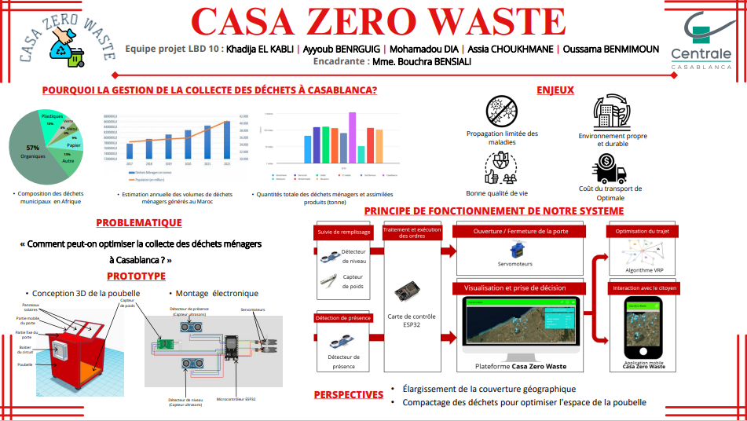
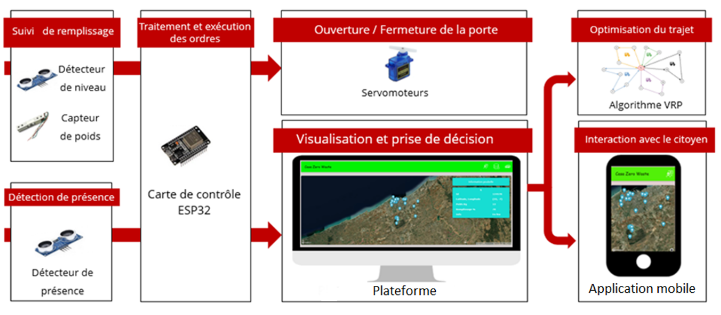

# Casa Zero Waste

  

**Project Duration**: 9 months  
**Goal**: To improve the quality of life for citizens by optimizing waste collection in Casablanca through smart waste management solutions.

## Project Summary

Living in a clean, well-equipped, and well-organized environment is essential for a good quality of life. Statistics and studies show that poor household waste management is a barrier to achieving this in Africa. Motivated by this issue, our team, PLBD 10, decided to work on optimizing waste collection in Casablanca. The solution focuses on developing a "smart" bin managed by a waste collection company through a web platform, while clients use a mobile application.

### The Smart Bin

Our smart bin is equipped with:
- **Ultrasonic sensors**: To detect fill levels and user presence.
- **Weight sensors**: To measure waste weight.
- **ESP32 microcontroller**: Acts as the bin's “brain,” controlling operations like automatic lid opening and data processing for fill levels.
- **Solar Panels**: Powers the bin sustainably.

### Key Components of the Project

1. **Casa Zero Waste Platform**: A centralized interface for waste management companies.
    - **Interactive map** for monitoring bins.
    - **Complaint feature** for users.
    - **Centralized database** for storing bin-related data.
    - **Truck tracking feature** for waste collection routes.

2. **Mobile Application**: Allows citizens to check bin availability and locations in real-time.

3. **Backend**: Developed with Python, handles data collection and processing from the smart bins. Stores information on fill levels and bin weights.

4. **Frontend**: Created with HTML, CSS, and JavaScript, ensuring a user-friendly interface.

5. **Database**: MySQL stores critical information such as bin status and location, ensuring persistent and accessible data.

### How Our System Works and Its Impact

The **Casa Zero Waste** project is crucial for the future, as efficient waste management has become a major concern. By integrating ultrasonic sensors, a microcontroller, and a web platform, this revolutionary system enables optimized waste collection, thereby reducing unnecessary trips, costs, and greenhouse gas emissions. Additionally, the mobile app empowers citizens by allowing them to plan waste disposal, avoiding overflowing bins.

This project is part of a broader effort to transition towards a more sustainable society, encouraging waste reduction, improved efficiency, and environmental preservation. By offering an intelligent solution for waste management, Casa Zero Waste contributes to building a cleaner, more sustainable, and environmentally conscious future for our planet.

### System Functionality

The system functions by:
1. Monitoring bin fill levels with ultrasonic and weight sensors.
2. Sending data to a central platform for analysis and route optimization using a Traveling Salesman Problem (VRP) algorithm.
3. Notifying the waste collection service when bins reach full capacity.
4. Allowing citizens to find and monitor bin availability via a mobile app.

  

### Technologies Used

- **Frontend**: HTML, CSS, JavaScript
- **Backend**: Python
- **Database**: MySQL
- **Microcontroller**: ESP32
- **Sensors**: Ultrasonic, Weight
- **Energy Source**: Solar panels

### Repository Contents

- **Code for Platform and Mobile App**: Implementation files for web and mobile applications.
- **Smart Bin Equipment Specifications**: Details on the sensors, microcontroller, and other hardware components.

 :

## Équipements Clés du Projet

### Plateforme Web

  

La plateforme web permet aux gestionnaires de surveiller en temps réel l’état des poubelles dans toute la ville, facilitant la planification des collectes pour éviter le débordement.

### Application Mobile

  

L’application mobile permet aux citoyens de vérifier l’état de remplissage des poubelles et de planifier leurs dépôts en conséquence.

### Prototype de la Poubelle Intelligente

  

Le prototype de la poubelle intelligente est équipé de capteurs et de panneaux solaires, permettant une gestion autonome et durable des déchets.

